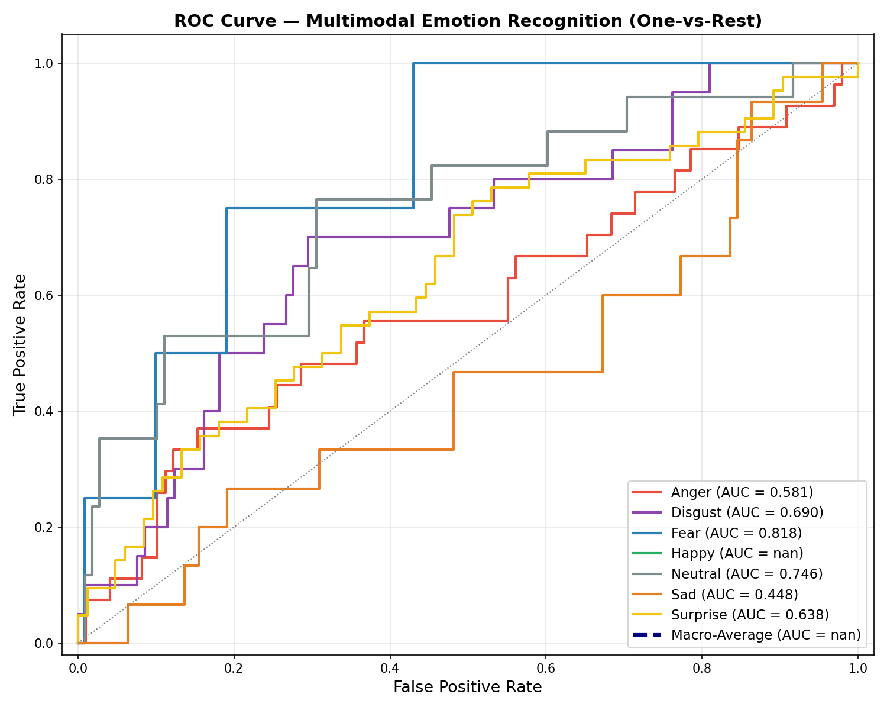

<](https://python.org)
[](https://tensorflow.org)
[](https://opencv.org)
[](LICENSE)

---

</div>

## 📌 Overview

**NeuroBioSense** is a multimodal deep learning system that classifies human emotions by jointly analyzing **facial video expressions** and **physiological biosignals** (accelerometer, BVP, EDA, temperature). The model fuses spatial-temporal features from video with sequential patterns from wearable sensor data to achieve robust emotion recognition across **7 emotion classes**.

<div align="center">

| Modality | Input | Encoder |
|:--------:|:-----:|:-------:|
| 🎬 **Video** | 16 frames × 112×112 RGB | MobileNetV2 + Bi-LSTM |
| 📊 **Biosignal** | 1280 × 6 channels | 1D-CNN + Bi-LSTM |

</div>

---

## 🏗️ Architecture

```
                    ┌──────────────────────────────────┐
                    │         VIDEO STREAM             │
                    │  16 frames × 112 × 112 × 3      │
                    └──────────────┬───────────────────┘
                                   │
                    ┌──────────────▼───────────────────┐
                    │   MobileNetV2 (TimeDistributed)   │
                    │     (ImageNet, last 10 unfrozen)  │
                    └──────────────┬───────────────────┘
                                   │
                    ┌──────────────▼───────────────────┐
                    │   GlobalAveragePooling2D (TD)     │
                    │        + Dropout (0.3)            │
                    └──────────────┬───────────────────┘
                                   │
                    ┌──────────────▼───────────────────┐
                    │     Bi-LSTM (128) → Bi-LSTM (64) │
                    │        + Dropout (0.4)            │
                    └──────────────┬───────────────────┘
                                   │
                                   ▼
                         ┌─────────────────┐
                         │                 │
                         │   Concatenate   │◄──────────────────────┐
                         │                 │                       │
                         └────────┬────────┘                       │
                                  │                                │
                    ┌─────────────▼──────────────┐   ┌─────────────┴───────────────┐
                    │  Dense(256) → BN → Drop(0.5)│   │     Bi-LSTM (64→32)         │
                    │  Dense(128) → Dropout(0.4)  │   │       + Dense(64)            │
                    │  Dense(7, softmax)           │   └─────────────┬───────────────┘
                    └─────────────┬──────────────┘                  │
                                  │                   ┌─────────────┴───────────────┐
                                  ▼                   │  Conv1D(32) → BN → MaxPool  │
                         ┌────────────────┐           │  Conv1D(64) → BN → MaxPool  │
                         │  7 Emotions    │           │       + Dropout (0.3)        │
                         └────────────────┘           └─────────────┬───────────────┘
                                                                    │
                                                      ┌─────────────┴───────────────┐
                                                      │     BIOSIGNAL STREAM        │
                                                      │     1280 × 6 channels       │
                                                      └────────────────────────────┘
```

---

## 🎯 Emotion Classes

| Code | Emotion | Description |
|:----:|:-------:|:-----------:|
| `A` | 😠 Anger | Expressions of anger or frustration |
| `D` | 🤢 Disgust | Expressions of disgust or aversion |
| `F` | 😨 Fear | Expressions of fear or anxiety |
| `H` | 😊 Happy | Expressions of happiness or joy |
| `N` | 😐 Neutral | Neutral baseline expressions |
| `SA` | 😢 Sad | Expressions of sadness or sorrow |
| `SU` | 😲 Surprise | Expressions of surprise or shock |

---

## 📂 Dataset Structure

The project uses the **NeuroBioSense** dataset, organized as follows:

```
NeuroBioSense/
├── Advertisement Categories/
│   ├── Car_and_Technology/
│   │   └── <Participant>/
│   │       └── <Ad>/
│   │           └── <Emotion>/
│   │               └── *.mp4          # Facial reaction videos
│   ├── Cosmetics_and_Fashion/
│   │   └── ...
│   └── Food_and_Market_Subfolder/
│       └── ...
├── Biosignal Files/
│   ├── Raw/                           # Raw sensor recordings
│   └── Pre-Processed/
│       └── 32-Hertz.csv               # Preprocessed biosignals (ACC, BVP, EDA, TEMP)
└── Participant Data/
```

### Biosignal Channels

| Channel | Sensor | Description |
|:-------:|:------:|:-----------:|
| X, Y, Z | Accelerometer | 3-axis motion data |
| BVP | Photoplethysmograph | Blood Volume Pulse |
| EDA | Electrodermal Activity | Skin conductance |
| TEMP | Thermometer | Skin temperature |

---

## 🚀 Getting Started

### Prerequisites

- Python 3.10+
- CUDA-compatible GPU (recommended)

### Installation

```bash
# Clone the repository
git clone https://github.com/<your-username>/NeuroBioSense.git
cd NeuroBioSense

# Create a virtual environment (recommended)
python -m venv venv
source venv/bin/activate        # Linux/macOS
venv\Scripts\activate           # Windows

# Install dependencies
pip install tensorflow opencv-python numpy pandas scikit-learn matplotlib
```

### Usage

```bash
# Train the model (or load pre-trained weights if available)
python multimodal_dl.py
```

On first run, the script will:
1. Scan the dataset directory for all video samples
2. Split data into **Train (70%) / Validation (15%) / Test (15%)** sets
3. Train the multimodal model for up to 40 epochs with early stopping
4. Save weights to `NeuroBioSense/multimodal_weights.weights.h5`
5. Evaluate on the test set and generate ROC curves
6. Run a prediction demo on a sample batch

On subsequent runs, pre-trained weights are loaded automatically — no retraining required.

---

## ⚙️ Training Details

| Hyperparameter | Value |
|:--------------:|:-----:|
| Optimizer | Adam (lr = 5e-5) |
| Loss | Categorical Cross-Entropy |
| Label Smoothing | 0.1 |
| Batch Size | 8 |
| Max Epochs | 40 |
| Early Stopping | patience = 7 (val_loss) |
| LR Reduction | factor = 0.5, patience = 3 |
| Video Backbone | MobileNetV2 (last 10 layers unfrozen) |
| Class Balancing | Inverse-frequency class weights |

### Data Augmentation

- **Video**: Random horizontal flip, brightness jitter (±0.1), contrast adjustment (0.8–1.2×)
- **Biosignal**: Gaussian noise injection (σ = 0.02)

---

## 📊 Results

### ROC Curve (One-vs-Rest)

<div align="center">



</div>

### Per-Class AUC Scores

| Emotion | AUC |
|:-------:|:---:|
| Fear | **0.818** |
| Neutral | 0.746 |
| Disgust | 0.690 |
| Surprise | 0.638 |
| Anger | 0.581 |
| Sad | 0.448 |

---

## 🛠️ Key Features

- **Multimodal Fusion** — Combines visual and physiological data streams for more robust emotion recognition than either modality alone
- **Transfer Learning** — Leverages ImageNet-pretrained MobileNetV2 with selective fine-tuning of deeper layers
- **Temporal Modeling** — Bidirectional LSTMs capture temporal dynamics in both video sequences and biosignal time series
- **Robust Preprocessing** — Biosignal resampling, normalization, NaN handling, and emotion-aware data sampling
- **Class Imbalance Handling** — Inverse-frequency class weights and label smoothing prevent model bias toward majority classes
- **Automated Pipeline** — End-to-end training, evaluation, and visualization with automatic weight persistence

---

## 📁 Project Structure

```
Deep Learning/
├── multimodal_dl.py              # Main training & evaluation script
├── README.md                     # This file
└── NeuroBioSense/
    ├── Advertisement Categories/ # Video dataset (MP4 files)
    ├── Biosignal Files/          # Wearable sensor data
    │   ├── Raw/
    │   └── Pre-Processed/
    ├── Participant Data/         # Participant metadata
    ├── multimodal_weights.weights.h5  # Trained model weights
    └── roc_curve.png             # ROC evaluation plot
```

---

## 📝 License

This project is licensed under the MIT License — see the [LICENSE](LICENSE) file for details.

---

## 🙏 Acknowledgements

- [MobileNetV2](https://arxiv.org/abs/1801.04381) — Sandler et al., 2018
- [TensorFlow](https://www.tensorflow.org/) — Google Brain Team
- NeuroBioSense dataset contributors

---

<div align="center">

**Built with ❤️ using TensorFlow & OpenCV**

</div>
]]>
